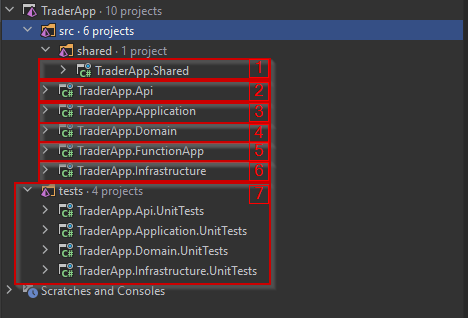

# TraderApp
Application made as a test assignment for recruiting purposes.
An application consists of two primary(driving) adaptors one is a web API project used to retrieve and list data saved in the blob and table storage. The second driving adaptor is an Azure function that gets data from the external page via HTTP Client and saves the result of that action to the blob & table storage. The azure function is meant to be run on the Http timer trigger.
## Tech stack
### General
- C# 11
- .Net framework 6.0
### Testing
  - nUnit
  - autofixture
  - nSubstitute

## Project Overview
The project is fallowing basic principles of clean architecture ( also called onion or hexagonal architecture).
To spice things up project also implements CQS(Command Query Separation) pattern by the author's implementation.
The project will use some of the tactical Domain Driven Design patterns but is not a fully DDD project. This is an architectural decision that was made and has a reflection in the decision log.

### Project structure

The project consists of 4 main layers:
- Primary adaptors: TraderApp.Api(number 2) & TraderApp.FunctionApp(number 5)
- Application: TraderApp.Application(number 3) - this is the layer that is doing all validation work and communicates with the infrastructure layer using domain entities and services.
- Domain: TraderApp.Domain - this layer holds all information about the domain. This layer shouldn't depend on any other layer nor any third-party tools but other layers can benefit from this layer.
- Infrastructure: TraderApp.Infrastructure(number 6) - This layer is working with Secondary(driven) adaptors, which means it's communicating with the external world.

- In this project, there is a separate folder to put tests for each of the layers (number 7)
- Project also has a shared layer(number 1) that isn't part of any other layer but can be used by any layer. This layer is transparent to all other layers. You can think of it as a separate package that is used to help structure a project. Use it wisely as this layer has benefits but also lot a of downsides when being used excessively.

### How to run locally
Create emulated azure environment using azurite. To run azurite as docker container locally run these scripts:
- docker pull mcr.microsoft.com/azure-storage/azurite
- docker run --name "azurite" -p 10000:10000 -p 10001:10001 -p 10002:10002 -e ACCOUNT_NAME="devstoreaccount1" -v c:/azurite:/data mcr.microsoft.com/azure-storage/azurite
Make sure you have correct table and blob storage account created with the name as in local.settings.json configuration (ContainerName and TableName)